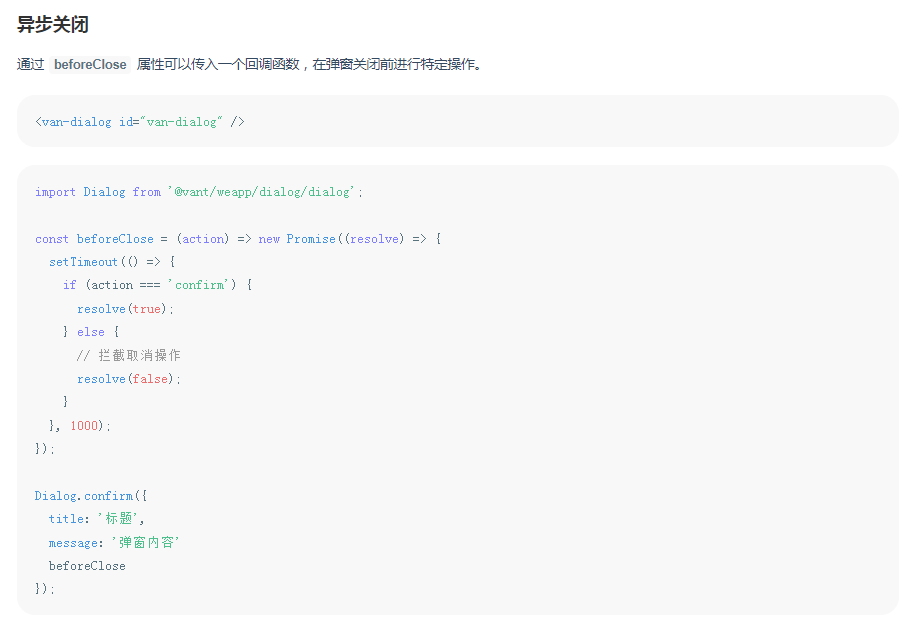

#### 授权登录页面

点击授权登录按钮

```typescript
handleConfirm() {
        /**
         * 此处需要接.then({ }).catch({ }),否则会报错
         * Error: MiniProgramError
         *  {"__wxExparserNodeId__":"0f7c27e9"}
         */
        Dialog.confirm({
            title: '微信授权',
            message: '计协报修小程序申请获取账号信息',
            beforeClose
        }).then(() => {
            // 确定
        }).catch(() => {
            // 取消
        })
    },
```

此处采用了[VantWeapp的Dialog弹出框](https://vant-contrib.gitee.io/vant-weapp/#/dialog)，函数调用，具体使用方法看手册，手册都有详细介绍



这里加了点类型定义

```typescript
// 类型定义
type Action = 'confirm' | 'cancel' | 'overlay';
// 登录处理函数
const login = async () => {
    // 获取code,用code来换取用户的openid
    let { code } = await wx.login()
    // 发起请求获取用户的openid
    let res: any = await getUserInfo({ code })
    let openid: string = res.data.data.openid
    if (openid) {
        Toast.success('授权登录成功');
        // 缓存用户openid
        wx.setStorageSync('openid', openid)
        wx.switchTab({
            url: '../index/index'
        })

    } else {
        // 轻提示
        Toast.fail('授权登录失败');
    }
}
// 对话框关闭前的回调函数,返回true关闭对话框,false阻止对话框关闭
const beforeClose = (action: Action) => new Promise<boolean>(async (resolve) => {
    // 返回true可关闭对话框
    if (action === 'confirm') {
        // 点击确认
        await login()
        resolve(true);
    } else {
        // 点击取消
        resolve(true)
    }
}) 
```

