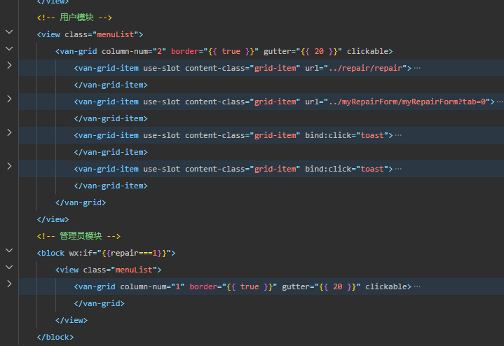

#### 首页

页面渲染完执行`getUserByOpenId()`函数

```typescript
  // 根据openid获取用户信息
        getUserByOpenId({openid}).then(res => {
            if (res.data.code === 200) {
                // 拿到repair的值来判断是否是管理员(0:为普通用户,1:管理员)
                let { repair } = res.data.data[0]
                this.setData({
                    repair
                })
            }
        })
```

获取到`repair`的值，来判断是否是管理员

通过` <block wx:if="{{repair===1}}"></block>`来判断是否显示管理员模块

