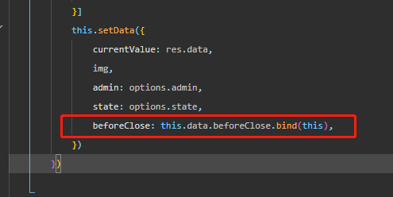

日期选择使用Vant Weapp的[Dialog 弹出框组件](https://vant-contrib.gitee.io/vant-weapp/#/dialog)，具体使用方法看开发文档

对话框关闭前的回调

```typescript
  // 对话框关闭前的回调
        beforeClose: function (action: any) {
            return new Promise<boolean>(async (resolve) => {
                // @ts-ignore
                let state: number = this.data.state
                if (action === 'confirm') {
                    // 确认
                    // @ts-ignore
                    await this.getRepair(state * 1)
                    resolve(true)
                } else {
                    resolve(true)
                }
            })
        },
```

页面渲染完毕，使用bind来绑定this，beforeClose是放在data里面使用并且是异步的但是方法里是无法访问到this的，需要在onload生命周期函数里去绑定this



如果不想，使用bind来绑定this，可以使用箭头函数

优化：

```typescript
 beforeClose: (action: any) => new Promise<boolean>(async (resolve) => {
            // @ts-ignore
            let state: number = this.data.state
            if (action === 'confirm') {
                // 确认
                // @ts-ignore
                await this.getRepair(state * 1)
                resolve(true)
            } else {
                resolve(true)
            }
        })
```

